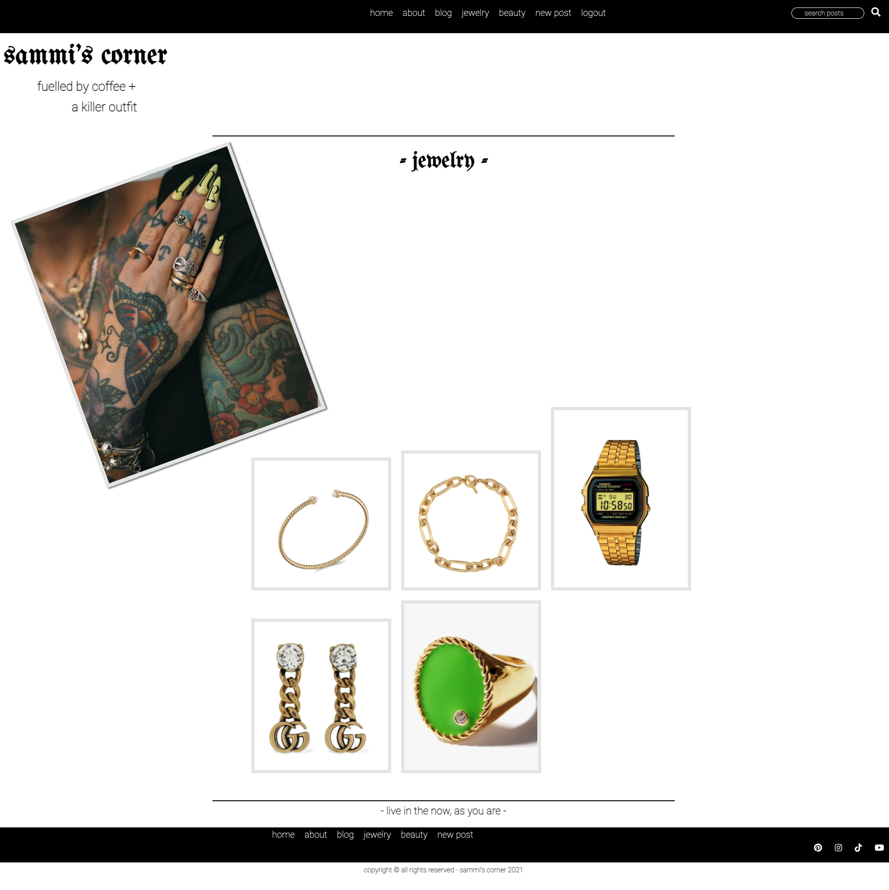

# sammi's corner

A fashion blog which highlights individuality and style. A site to showcase simple outfits with snappy descriptions. As you browse sammi's corner you'll also be directed to pages where you can shop some of her favorite things via direct links. Full CRUD capabilities can be performed and users who are authorized can like and comment on each blog post.

## `Technologies Used`

* HTML5
* CSS3
* Python
* Django
* [Figma](https://www.figma.com/files/user/979381893432674988?fuid=979381893432674988)
* [Color Hunt](https://colorhunt.co/)
* [Sammi Jefcoate](https://www.sammijefcoate.com/)
* [Instagram](https://www.instagram.com/sammijefcoate/)
* [Invisionapp](https://www.invisionapp.com/inside-design/design-resources/do/)
* [Google Fonts](https://fonts.google.com/) 
* [Procreate](https://procreate.art/)

## `User Stories`

* As a user, I would like some sense of security and to be able to login and have my activity saved in one place
* As a user, I want to be able to get to a snippet of the life and style of Sammi
* As a user, I want to be able to like and comment on blog posts
* As a user, I want to be able to search the site to find specific posts
* As a user, I want to be able to edit and update my created posts
 
## `Screenshots`

### Wireframe

### Working App

   

## `Future Enhancements`
Some future enhancements for sammi's corner would be to :
* add restrictions to who can make, edit and delete blog posts 
* add a blog category nav bar
* reply to comments
* create a profile page for users, that can also be updated 
* add username and image to the nav bar when user is logged in
* enable caplability to update the photo of a blog post
* COMPLETED -- implement a cloud storage service to store my images permanantly because heroku doesn't save the media files

## `Getting Started`

* [Click here](https://trello.com/b/y1Dy21Kj/sammis-corner) to see the Trello Board!
<!-- * [Click here](https://shrouded-retreat-89485.herokuapp.com/) to see the deployed app! -->